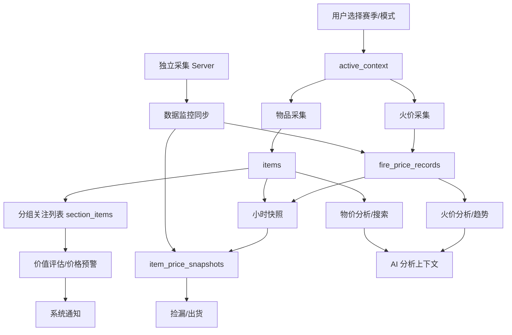

# TL 物品火价监控项目复查与业务逻辑分析报告

生成时间：2026-05-03  
检查范围：当前工作区代码、前端/后端命令契约、Tauri 配置、采集服务、数据库模型、核心业务闭环。  
检查方式：静态代码阅读、命令注册检查、前端构建、TypeScript 类型检查、Rust 编译和测试、ESLint。

## 一句话结论

项目已经从“功能堆叠阶段”进入“业务闭环成型阶段”：普通服/专家服、历史快照、捡漏出货、AI 分析、数据监控等模块的轮廓都已经存在，而且这轮修复后命令注册、构建链路、火价历史按赛季/模式过滤等关键点有明显改善。

但目前还不建议直接发版。主要原因不是“跑不起来”，而是若干业务链路仍然会产出错误数据或无效提醒：自动火价采集没有立即持久化且仍默认普通服、上下文切换后缓存不一致、捡漏算法的基线取法偏差较大、预警规则没有真正进入通知任务、数据监控整赛季同步接口不闭合。

## 自动化检查结果

| 检查项 | 结果 | 说明 |
|---|---:|---|
| `npm run typecheck` | 通过 | TypeScript 类型检查通过。 |
| `npm run vite:build` | 通过 | 生产构建通过，构建产物刷新到 `dist-react`。 |
| `cargo check` | 通过，有 warning | Rust 可编译，但存在未使用 import/变量、命名等 warning。 |
| `cargo test` | 通过 | 当前 8 个测试均通过，主要覆盖 `worth_service`。 |
| 前端 invoke / 后端 handler 对齐 | 通过 | 57 个前端调用均有 handler，后端剩余 `get_items_stats`、`reload_items` 暂未被前端使用。 |
| `src` 目录 `npm run lint` | 失败 | 当前 56 个 error、5 个 warning，主要是未使用变量、`any`、React hooks 规则、fast-refresh 规则。 |

## 本轮已改善点

1. `get_deal_alerts` 已注册到 Tauri handler，前端 `DealsPage` 不再调用缺失命令。
2. Rust `AppConfig` 已加入 `deal` 配置段，前后端配置模型开始对齐。
3. `repo_fire::get_latest_fire`、`repo_fire::get_fire_history` 已按 `season_id + market_mode` 查询，火价历史不再直接混用所有模式。
4. 启动迁移后会 seed `ss12/ss11/ss10`，减少外键缺基础赛季的问题。
5. `tauri.conf.json` 已补 `beforeBuildCommand`，Tauri 打包时会跑前端 typecheck 和 build。
6. `item_price_snapshots` 已成为物价历史/捡漏算法的数据来源，方向比之前的 mock 更接近真实业务。
7. 独立采集 server 已支持普通服/专家服双模式采集和 `/items-history-all`。

## 业务逻辑总览

当前系统的核心商业目标可以概括为：

1. 按赛季和市场模式采集火价、物品价格。
2. 将实时数据和历史快照沉淀到 SQLite。
3. 用户维护自己的关注分组、买入价、数量和额外价值。
4. 系统计算当前是否值得购买、是否出现捡漏/出货机会。
5. 对关键事件进行通知，并支持历史分析、AI 辅助和数据迁移。

这个方向是对的，但“采集 -> 存储 -> 分析 -> 通知”的闭环还需要补几处关键连接。

## 模块分析

### 1. 启动、配置与上下文

当前启动流程在 `src-tauri/src/app.rs` 中完成：初始化 SQLite、跑迁移、读取配置、加载最新火价、自动导入物品、创建 `AppState`、启动后台任务。

主要问题：

- `active_context` 启动时固定为 `MarketMode::SeasonNormal`，没有使用 `config.scrape.fire_price_mode`。
- 启动兜底抓火价时固定写入 `ss12 + season_normal`，如果用户配置了其他赛季或专家服，会污染默认数据。
- `set_active_market_context` 只改内存里的 `season_id/market_mode`，没有同步加载该上下文最新火价，也没有发 `market-context-changed` 事件。
- `save_config` 只同步 `ctx.season_id`，没有同步 `ctx.market_mode`。
- `get_dashboard_summary` 使用 `state.fire_price` 这个全局缓存，切换模式后可能展示上一模式的火价。

建议：

1. 将“当前上下文”抽成唯一状态源：启动时来自 config，切换时同时更新 config、state、事件和查询缓存。
2. `set_active_market_context` 成功后立即从 DB 查询该上下文最新火价，更新 `state.fire_price`。
3. Dashboard 不直接相信全局 `fire_price`，而是优先按当前上下文查询 `fire_price_records` 最新记录。
4. 明确 `season_id` 与 `market_mode` 的 URL/API 映射，避免各模块各自写 `season_normal`/`normal` 转换。

### 2. 火价采集与历史

当前手动刷新 `refresh_fire_price` 会抓取火价并写入 `fire_price_records`；后台 `fire_task` 会周期抓取并更新内存缓存、发事件。

关键风险：

- `run_fire_scrape_task` 调用的是 `scraper::scrape_fire_price()`，该函数默认抓“普通”模式，不根据 `active_context.market_mode` 抓专家服。
- `run_fire_scrape_task` 成功后没有立即写入 `fire_price_records`，只更新 `state.fire_price`。历史数据主要依赖 `history_task` 的整点快照补写。
- `history_task` 先 sleep 到下一个整点，进入 loop 后又 sleep 3600 秒才写快照，实际会延后一小时记录第一条整点数据。
- 如果 `state.fire_price` 是普通服价格，而 `active_context` 被切到专家服，整点快照可能把普通服价格写到专家服上下文。

建议：

1. 将 `qiandao::scrape_by_mode` 公开并统一用 `MarketMode` 参数调用。
2. 周期火价抓取成功后立即写 `repo_fire::insert_fire_record`，整点快照只负责聚合/对齐，不承担唯一持久化职责。
3. `history_task` 在初始 sleep 到点后应立即执行一次快照，再进入 3600 秒循环。
4. 火价数据记录建议增加 `provider_mode` 或 `source_mode`，便于排查外部 API 返回与本地上下文不一致的问题。

### 3. 物品采集、搜索与快照

当前物品采集链路相对清晰：`scraper::scrape_items(season_id, market_mode)` 按赛季和模式计算 API season id，写入 `items`，后台任务维护 `items_cache`，小时快照写入 `item_price_snapshots`。

风险点：

- 启动时如果 `items` 表已经有数据，`items_cache` 会是空。若自动刷新关闭，小时快照就不会记录物品快照。
- `get_items_count` 是全表统计，不按当前上下文统计。Dashboard 在多赛季/多模式下会显示总数而不是当前模式物品数。
- `clear_items_database` 会同时删 `items` 和 `section_items`，对用户关注列表影响很大，当前虽然有确认框，但仍建议区分“清空行情缓存”和“清空关注列表”。
- `reload_items` 命令仍固定 `season_normal`，虽然当前未被前端使用，但后续如果重新接入会带来专家服错抓。

建议：

1. 启动时从 DB 按当前上下文预热 `items_cache`，或者让小时快照直接从 DB 读取当前上下文 items。
2. Dashboard 的 `item_count` 改为当前上下文统计，同时保留全库统计作为数据库指标。
3. 清空功能拆成三个动作：清空行情、清空历史快照、清空关注列表。
4. 删除或修复未使用的 `reload_items`，避免未来误接。

### 4. 分组、关注列表与价值评估

关注列表的核心表是 `sections` 与 `section_items`。`section_items` 保存用户买入价、数量和额外价值，查询时 join 当前物品价格得到 `current_price`。

当前逻辑适合第一版使用，但策略化还没真正展开：

- `strategies` 表存在，页面也存在，但 section 与 strategy 的关联、策略参数对评估结果的影响还比较弱。
- `repo_sections::get_totals` 当前用买入火价汇总 `total_fire`，用当前物品价格汇总 `total_rmb`，字段含义容易让用户误解。“RMB” 实际仍是火价价值，不是人民币价值，除非再乘火价换算。
- `update_section_item/remove_section_item` 只按 `section_id + item_id` 更新，不带 `season_id + market_mode`，如果同一分组未来允许跨模式同物品，会误更新。

建议：

1. 明确分组是否跨赛季/跨模式。如果不跨，则 section 也应有 season/mode 归属；如果跨，则更新和删除必须带完整主键。
2. Dashboard 总资产建议拆成“投入火数”“当前火数”“浮盈火数”“折合 RMB”四项。
3. 策略参数应进入 `evaluate_worth`，例如手续费、目标利润率、最低流动性、冷却时间。

### 5. 捡漏出货

这轮 `DealsPage` 和 `commands/deals.rs` 已从 mock 改为基于真实 `item_price_snapshots` 计算，这是方向正确的一步。

当前算法问题较明显：

- 代码注释说“closest to 24h ago”，但 SQL 实际取的是 cutoff 之后的最大 `scraped_at`，也就是窗口内最新快照；1h baseline 也同理。这很可能取到接近当前的记录，导致涨跌幅趋近 0。
- 优先使用 1h baseline，但如果快照频率是 1h，baseline 可能与当前 items 最新价格处于同一批采集或相邻很近，难以判断真实机会。
- 后端硬编码 `change_percent < -10` 与 `> 15`，前端再按用户设置过滤。用户把阈值设为 5% 时，后端已经丢掉了 5%-10% 的捡漏机会。
- `DealSettings` 的开启/关闭只在前端 query enabled 和过滤层生效，后端不读取配置。
- `confidence` 基本固定为 70，因为 `sample_count` 永远是 1，无法表达数据可信度。
- 查询没有排除极端异常值、低价噪声和缺失流动性的物品。

建议：

1. 先定义业务语义：捡漏是“当前价低于 N 小时均线/历史分位/上一快照”还是“短时跳水”。
2. baseline 可提供三种：上一快照、24h 均价、7d 分位。前端允许切换。
3. SQL 应取“目标时间附近最近的一条”，例如 `ORDER BY ABS(scraped_at - target_ts) LIMIT 1`，或按小时聚合后 join。
4. 后端读取 `config.deal`，阈值、开关、最大条数都在后端生效。
5. 结果增加 `baseline_window`、`sample_count`、`liquidity_hint`、`reason`，让用户知道为什么被推荐。

### 6. 价格预警与通知

项目已有三套相近概念：`alert_rules`、`price_alert_enabled`、`DealsPage` 阈值。但后台任务目前只检查关注列表里“当前价 < 用户买入价”的物品。

主要缺口：

- `run_price_alert_task` 没有读取 `alert_rules`，也没有写 `alert_events`。
- `cooldown_seconds`、`last_triggered_at`、quiet time 没有在后台任务中使用。
- 找到 worth item 后每 60 秒都可能重复通知。
- `AlertsPage` 文件存在，但没有接入 Sidebar/App，用户无法管理规则和事件。
- `trigger_price_alert` 与后台 `alert_task` 各自实现一套 worth item 逻辑，容易分叉。

建议：

1. 抽出统一 Alert Engine：输入当前上下文、section items、rules、config，输出 alert events。
2. `run_price_alert_task` 应读取 enabled rules，判断 cooldown/quiet hours，触发后写 `alert_events` 并更新 `last_triggered_at`。
3. 将 `AlertsPage` 接入导航，展示规则、历史事件、已读状态和手动测试。
4. 预警类型建议支持：低于目标价、涨跌幅超过阈值、利润率达到目标、火价超过区间、捡漏榜新出现。

### 7. 数据监控与独立采集 Server

独立 server 的方向有价值：它可以常驻采集普通服和专家服，再由桌面端按需同步历史。当前实现已经支持 `/status`、`/fire-history`、`/items-history`、`/items-history-all`。

主要问题：

- 前端整赛季火价同步调用 `/fire-history-all`，server 没有这个路由，会返回 404。
- 前端整赛季同步传 `season_id` 和 `market_mode`，但 server 当前大多数路由只看自己的 `state.config.season_id` 和 `mode` 参数，忽略前端的 `season_id/market_mode`。
- `/items-history-all` 当 limit > 1000 时会固定 `LIMIT 1000`，不是真正整赛季。
- Tauri CSP 当前是 `connect-src 'self'`，前端直接 `fetch(http://localhost:8080)` 或 AI API 在生产 WebView 中可能被 CSP 拦截。
- server 自写 HTTP parser，只读 4096 字节，对 URL 编码、OPTIONS 预检、复杂 query、长请求都不稳。

建议：

1. 补 `/fire-history-all`，并统一支持 `season_id + mode/market_mode + cursor/limit`。
2. 数据同步改成分页游标：`?after=timestamp&limit=1000`，避免一次全量和固定截断。
3. 用 `axum` 或 `warp` 替换手写 TCP HTTP 解析。
4. 桌面端不直接 fetch 外部服务，改由 Tauri command 代理请求；或者明确放开 CSP 的可信源。
5. 同步前做 preview：显示将导入多少条、重复多少条、目标赛季/模式是什么。

### 8. AI 分析

AI 页面已经具备提供商配置、上下文拼接和对话 UI，但目前还更像实验功能。

风险点：

- API key 存在 `localStorage`，安全性较弱。
- 直接从前端 fetch 外部 API，受 CSP、CORS、密钥暴露影响。
- 传给 AI 的上下文只有 24h 火价摘要，缺少关注列表、捡漏榜、历史分位、当前模式等高价值数据。
- `fireData[fireData.length - 1]` 可能不是最新记录，因为后端历史按 DESC 返回，最新通常在第 0 个。

建议：

1. API key 存入系统 keychain/安全存储，调用走后端代理。
2. 增加 AI 上下文构建器：当前火价、24h/7d 分位、关注列表浮盈、捡漏榜、用户策略。
3. 预设问题模板接入真实函数，例如“一键分析我的关注列表风险”。
4. AI 回复增加免责声明和引用数据时间，避免过期行情被误用。

### 9. 设置、导入导出与安全配置

设置页功能较多，但保存逻辑现在会重建整个 `AppConfig`，容易覆盖别的页面保存的配置。

风险点：

- `SettingsPage.handleSave` 固定把 `deal` 重置为默认 30%，会覆盖 `DealsPage` 中用户保存的阈值。
- `fire_price_mode` 固定写成 `season_normal`，没有 UI 控件，也会覆盖模式配置。
- `voice_alert_path` 写死为本机绝对路径。
- 前端 `NotificationSettings` 类型缺少 Rust 里的 `mac_desktop_notifications` 和 `win_desktop_notifications`。
- `ImportExportPage` 展示的 CSV 格式与后端实际解析字段不一致。UI 写的是 `section_id,item_id,item_name,item_type,price,count,more_per_fire`，后端实际按 `section_id,season_id,market_mode,item_id,purchase_fire_price,count,more_value` 解析。
- `import_watchlist_csv` 只检查 `record.len() >= 3`，但后面读取到第 6 列，短行可能以空 item id 导入。
- `restore_database` 直接覆盖 DB 文件，没有关闭连接/重启保护，运行中恢复可能导致状态与磁盘不一致。
- Tauri capability 允许 `$HOME/**` 读写，权限过大。
- CSP 使用 `script-src 'unsafe-eval'` 和 `connect-src 'self'`，既有安全风险，也会阻断需要的外部请求。
- 抓取代码使用 `danger_accept_invalid_certs(true)`，生产环境风险较高。

建议：

1. 设置保存改为“读取当前 config -> patch 局部字段 -> 保存”，不要重建完整 config。
2. JSON 文件选择使用 `select_local_items_file`，不要写死用户机器路径。
3. CSV 导入做 schema 校验、dry-run、错误行下载、模板导出。
4. DB 恢复流程改为：选择备份 -> 校验 schema -> 创建临时副本 -> 提示重启 -> 下次启动替换。
5. 收紧 fs 权限到 app data、download/export 目录，减少 `$HOME/**`。
6. 移除不必要的 `unsafe-eval`，外部 HTTP/API 走后端代理或显式 allowlist。

## 关键问题优先级

| 优先级 | 问题 | 影响 | 证据 |
|---|---|---|---|
| P0 | 自动火价任务不按模式抓取，也不立即入库 | 专家服数据可能错、历史数据缺失、分析基于错误数据 | `src-tauri/src/scheduler/fire_task.rs:38`, `src-tauri/src/scheduler/fire_task.rs:56` |
| P0 | 上下文切换后火价缓存不刷新 | Dashboard/分析页可能显示上一模式火价 | `src-tauri/src/commands/fire.rs:12`, `src-tauri/src/commands/fire.rs:49` |
| P1 | 小时快照第一条会延后一小时 | 初始运行后历史快照不及时，影响 deal/趋势 | `src-tauri/src/scheduler/history_task.rs:33`, `src-tauri/src/scheduler/history_task.rs:47` |
| P1 | 捡漏算法取到窗口内最新快照而非目标时间基线 | 捡漏/出货结果可能大量漏报或误报 | `src-tauri/src/commands/deals.rs:71`, `src-tauri/src/commands/deals.rs:88` |
| P1 | 预警规则未进入后台任务 | 用户配置的 alert_rules 无实际效果 | `src-tauri/src/scheduler/alert_task.rs:51`, `src-tauri/src/db/repo_alerts.rs` |
| P1 | 数据监控整赛季火价接口不闭合 | `/fire-history-all` 会 404，整赛季火价同步失败 | `src/components/dashboard/DataMonitorPage.tsx:121`, `src-tauri/src/bin/server.rs:200` |
| P1 | 设置页保存会覆盖其他配置 | deal 阈值、模式、语音路径等会被重置 | `src/components/dashboard/SettingsPage.tsx:149` |
| P2 | ESLint 失败 | CI/维护质量不达标，隐藏 React hooks 问题 | `npm run lint` 输出 56 errors/5 warnings |
| P2 | CSV 文档和解析不一致 | 用户按页面提示导入会错位或失败 | `src/components/dashboard/ImportExportPage.tsx:168`, `src-tauri/src/commands/import_export.rs:49` |
| P2 | CSP/权限/证书策略不适合生产 | 安全风险和外部功能被阻断并存 | `src-tauri/tauri.conf.json:27`, `src-tauri/capabilities/default.json:37` |

## 推荐优化路线

### 第一阶段：发版阻断修复

目标：保证数据正确、核心功能可用。

1. 修复火价采集：按当前模式抓取，成功后立即写入 DB，整点快照只做补充。
2. 修复上下文切换：切换赛季/模式后同步 config/state/fire cache/query cache/event。
3. 修复 `history_task` 第一条快照延迟问题，并让物品快照从 DB 读取，不依赖空 cache。
4. 补齐 DataMonitor `/fire-history-all` 或改前端整赛季同步走分页 `/fire-history`。
5. Settings 保存改成 patch 模式，避免覆盖 deal/notification/data 等配置。
6. 先清理 ESLint 中未使用变量、空 block、明显 `any`，把 lint 纳入根目录脚本。

### 第二阶段：业务闭环增强

目标：让“分析、捡漏、预警”可信。

1. 重做 Deal Alert 算法：支持上一快照、24h 均线、7d 分位三种基线。
2. Alert Engine 接入 `alert_rules`、cooldown、quiet hours、alert_events。
3. 将 `AlertsPage` 接入导航，形成规则管理和事件回看。
4. Dashboard 资产指标拆成投入、当前、浮盈、折 RMB。
5. 火价/物价分析全部显示数据时间、样本数、当前赛季/模式。

### 第三阶段：产品体验和可靠性

目标：把工具从“能用”提升到“适合长期使用”。

1. 独立采集 server 改为 axum + 分页 API + token 鉴权。
2. 增加数据健康面板：最近采集延迟、失败次数、缺失小时、重复记录。
3. 导入导出增加模板、dry-run、冲突处理和回滚。
4. AI 改为后端代理，密钥安全存储，提供真实行情上下文。
5. 增加关键路径测试：采集入库、上下文切换、deal 计算、alert cooldown、CSV import。

## 功能性建议

### 捡漏雷达

- 支持“短时跳水”“低于 24h 均价”“低于 7d 分位”“关注列表目标价”四个筛选维度。
- 每个机会显示：当前价、基准价、跌幅、历史分位、最近更新时间、推荐原因。
- 加一键操作：加入关注、设置目标价、忽略该物品、复制搜索关键词。

### 出货助手

- 对用户关注列表计算浮盈，按“收益火数”“收益率”“RMB 估值”排序。
- 支持卖出提醒：达到目标利润率、达到目标火价、火价处于高位。
- 提供“分批出货建议”，例如卖出 30%、保留 70%。

### 赛季对比

- 配置每个赛季的开服时间，用“开服第 N 天第 H 小时”对齐，而不是用 Unix day `% 365`。
- 支持当前赛季 vs 历史赛季同期开服曲线。
- 给出当前火价水平：历史分位、同期均值差、波动区间。

### 数据监控中心

- 增加“采集器状态 + 桌面端状态 + 同步状态”三段式页面。
- 同步时显示预览：来源模式、目标模式、记录数、重复数、最早/最晚时间。
- 支持断点续传和失败重试。

### 预警中心

- 规则模板：低于买入价、低于目标价、涨跌超过 X%、火价高于/低于阈值。
- 通知聚合：同一分钟多个物品合成一条通知。
- 事件中心：未读、已读、忽略、再次提醒。

### AI 分析助手

- 让 AI 可以读取结构化摘要，而不是只读聊天文本。
- 提供固定 prompt 模板：今日行情、我的关注列表、捡漏解释、出货建议、风险复盘。
- AI 输出附上数据时间和样本数量。

### 数据质量

- 对异常价格做标记：0、极大值、短时暴涨暴跌、长时间未更新。
- 每个 item 保留采集来源、采集耗时、最近失败原因。
- 增加重复记录、缺失小时、模式错配的检测任务。

## 建议新增测试

1. `repo_fire`：插入普通/专家两组记录后，查询必须只返回当前模式。
2. `fire_task`：给定专家服 context，抓取函数必须收到专家服参数，并写入专家服记录。
3. `history_task`：启动到整点后应立即写一条快照。
4. `deals`：构造当前价和 24h 前价格，验证捡漏/出货阈值。
5. `alert_task`：验证 cooldown、quiet hours、alert_events 写入。
6. `SettingsPage`：保存部分设置时不覆盖 `deal` 和 `data`。
7. `DataMonitorPage`：整赛季同步不会调用不存在路由。
8. CSV import：表头不符、列数不足、item 不存在都应返回明确错误。

## 总体建议

当前最值得先做的不是继续加新页面，而是把已有页面背后的数据闭环补严。这个项目的价值核心在“数据可信 + 提醒及时 + 建议可解释”。只要火价/物价采集的模式一致性、历史快照、捡漏算法和预警规则打通，后续 AI、策略、赛季对比都会自然变得更有用。

建议下一轮按以下顺序推进：

1. 火价采集和上下文一致性。
2. 快照与历史数据可靠性。
3. Deal 算法可信度。
4. Alert Engine 闭环。
5. DataMonitor 和 AI 的安全代理化。
6. Lint/测试/CI 收口。
