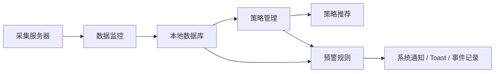

# 策略管理 / 预警规则 / 数据监控阶段开发文档 - 2026-05-08

## 1. 文档目标

本文档按项目当前阶段梳理三个模块的开发方向：

- 策略管理：在现有“策略收益分析”基础上补齐策略模板和策略推荐。
- 预警规则：把已经存在的规则数据表和命令接成完整产品闭环。
- 数据监控：在现有可用同步能力上补齐分页、增量同步和失败明细。

本阶段不重做已有功能，优先补齐缺失闭环和提升可信度。

## 2. 当前状态总览

| 模块 | 当前状态 | 已有基础 | 本阶段重点 |
| --- | --- | --- | --- |
| 策略管理 | 主体功能已开发，不是占位 | `StrategiesPage.tsx`、`strategy_details`、`strategy_costs`、`strategy_outputs`、策略成本/产出计算 | 策略模板、策略推荐、推荐理由 |
| 预警规则 | 后端基础已开发，前端和任务闭环未完成 | `alert_rules`、`alert_events`、CRUD 命令、设置页通知开关、Tauri 事件监听 | 独立规则页面、按规则执行后台任务、事件落库 |
| 数据监控 | 页面和同步链路已可用 | `DataMonitorPage.tsx`、`ServerAdminPanel`、`/fire-history-all`、`/items-history-all`、本地同步命令 | 分页/增量同步、进度反馈、失败明细 |

## 3. 模块关系



核心关系：

- 数据监控保证本地数据新鲜度。
- 策略管理基于本地价格数据计算收益。
- 预警规则基于监控项、策略收益和价格变化触发通知。

## 4. 策略管理

### 4.1 当前已有能力

前端：

- `src/components/dashboard/StrategiesPage.tsx`
- 支持新建、编辑、删除策略。
- 支持添加成本项和产出项。
- 支持按收益率排序。
- 支持刷新实时火价。

后端命令：

- `get_all_strategies_with_costs`
- `create_strategy_detail`
- `update_strategy_detail`
- `delete_strategy_detail`
- `add_strategy_cost`
- `add_strategy_output`
- `refresh_strategy_fire_prices`

数据库：

- `strategy_details`：策略主体。
- `strategy_costs`：策略成本项。
- `strategy_outputs`：策略产出项。

### 4.2 本阶段目标

策略管理不再按“重新开发”处理，而是在现有页面上新增两个能力：

1. 策略模板：降低用户录入成本。
2. 策略推荐：根据当前价格和风险指标排序，告诉用户哪个策略更值得跑。

### 4.3 页面规划

建议把策略页拆成三个 Tab：

| Tab | 说明 |
| --- | --- |
| 我的策略 | 保留现有收益分析、成本/产出管理、收益排序 |
| 模板库 | 展示内置策略模板，支持一键创建 |
| 推荐榜 | 基于当前价格、收益率、风险和数据新鲜度给出推荐 |

### 4.4 策略模板设计

第一阶段建议使用前端内置模板，不急着新增模板表。

建议文件：

- `src/lib/strategyTemplates.ts`

模板数据结构：

```ts
export interface StrategyTemplate {
  id: string;
  name: string;
  label: "K8" | "U8" | "深空" | "普通";
  difficulty: string;
  output_value: number;
  defense_value: number;
  remark: string;
  costs: StrategyTemplateCost[];
  outputs: StrategyTemplateOutput[];
}

export interface StrategyTemplateCost {
  cost_type: string;
  item_keyword: string;
  default_count: number;
  is_realtime: boolean;
}

export interface StrategyTemplateOutput {
  item_keyword: string;
  item_type: string;
  default_count: number;
}
```

推荐首批模板：

| 模板 | 用途 | 特点 |
| --- | --- | --- |
| K8 标准刷图 | 常规打宝 | 成本和产出都较通用 |
| U8 高投入刷图 | 高门槛收益分析 | 成本高，收益波动也高 |
| 深空收益模板 | 深空玩法 | 适合单独跟踪深空相关收益 |
| 低成本稳定模板 | 小投入试跑 | 降低新用户录入难度 |
| 高风险高收益模板 | 波动策略 | 用于推荐榜风险展示 |

一键创建流程：

1. 用户在模板库点击“创建策略”。
2. 前端调用 `createStrategyDetail` 创建策略主体。
3. 根据模板成本项调用 `searchItems` 辅助匹配物品。
4. 调用 `addStrategyCost` / `addStrategyOutput` 写入成本和产出。
5. 创建完成后跳转到“我的策略”并展开新策略。

后续如果要支持用户自定义模板，再新增：

- `strategy_templates`
- `strategy_template_costs`
- `strategy_template_outputs`

### 4.5 策略推荐设计

推荐先用透明规则评分，不优先上 AI。AI 可以后续只负责解释，不负责核心判断。

推荐输入：

- 当前策略成本总火数。
- 当前策略产出总火数。
- 收益率 `profit_ratio`。
- 成本物品和产出物品的数据更新时间。
- 最近价格波动。
- 策略门槛：输出值、防御值、难度、标签。

推荐输出：

```ts
export interface StrategyRecommendation {
  strategy_id: string;
  strategy_name: string;
  score: number;
  level: "strong" | "good" | "watch" | "avoid";
  expected_profit_fire: number;
  profit_ratio: number;
  risk_level: "low" | "medium" | "high";
  reasons: string[];
  warnings: string[];
}
```

评分建议：

| 维度 | 权重 | 说明 |
| --- | --- | --- |
| 收益率 | 35 | 收益率越高越推荐 |
| 净收益 | 20 | 绝对收益不能太低 |
| 数据新鲜度 | 15 | 价格越新越可靠 |
| 价格波动风险 | 15 | 波动越大风险越高 |
| 成本门槛 | 10 | 总成本太高要降分 |
| 策略门槛匹配 | 5 | 输出/防御/难度用于提示 |

推荐等级：

| 等级 | 分数 | UI 文案 |
| --- | --- | --- |
| strong | 80-100 | 强烈推荐 |
| good | 60-79 | 可跑 |
| watch | 40-59 | 观望 |
| avoid | 0-39 | 不建议 |

第一阶段可以先在前端基于 `getAllStrategiesWithCosts` 计算推荐榜。后续如果要统一逻辑、写测试和复用，可迁移到后端命令：

- `get_strategy_recommendations`
- `explain_strategy_recommendation`

### 4.6 策略管理验收标准

- 模板库至少提供 4 个内置模板。
- 模板可以一键生成策略，并自动写入成本/产出。
- 推荐榜可以按分数排序，并展示推荐等级、收益率、预计收益、风险和原因。
- 空数据、价格缺失、成本为 0 时有明确提示，不出现 `NaN` 或无意义推荐。
- `npm run typecheck` 通过。

## 5. 预警规则

### 5.1 当前已有能力

数据库：

- `alert_rules`
- `alert_events`

后端命令：

- `get_alert_rules`
- `create_alert_rule`
- `update_alert_rule`
- `toggle_alert_rule`
- `delete_alert_rule`
- `get_alert_events`

现有任务：

- `alert_task` 每 60 秒运行。
- 当前逻辑主要检查监控列表里的价格倒挂物品并发送通知。

现有缺口：

- 没有独立预警规则页面。
- 前端没有消费 `alert_rules` CRUD。
- `alert_task` 尚未按 `alert_rules` 逐条判断。
- `alert_events` 的创建没有形成完整触发链路。

### 5.2 本阶段目标

本阶段目标是完成“规则创建 -> 后台检查 -> 冷却控制 -> 事件记录 -> 通知展示”的闭环。

### 5.3 页面规划

新增页面：

- `src/components/dashboard/AlertsPage.tsx`

侧边栏建议新增：

- `PageId`: `alerts`
- 文案：`预警规则`
- 图标：`Bell`

页面结构：

| 区块 | 功能 |
| --- | --- |
| 规则列表 | 查看规则、启用/禁用、删除 |
| 新建/编辑弹窗 | 设置目标、条件、阈值、冷却时间 |
| 事件记录 | 展示最近触发的预警 |
| 快捷筛选 | 全部、启用中、已停用、最近触发 |

### 5.4 规则类型设计

先支持 4 类规则：

| rule_type | 含义 | 目标 |
| --- | --- | --- |
| `price_below` | 物品价格低于阈值 | 单个物品或监控项 |
| `price_above` | 物品价格高于阈值 | 单个物品或监控项 |
| `profit_ratio_above` | 策略收益率高于阈值 | 策略 |
| `price_drop_percent` | 价格跌幅超过阈值 | 单个物品 |

当前 `alert_rules` 表字段可以覆盖第一版：

- `strategy_id`：策略规则。
- `section_id`：板块规则。
- `item_id`：物品规则。
- `rule_type`：规则类型。
- `threshold`：阈值。
- `cooldown_seconds`：冷却时间。
- `last_triggered_at`：上次触发时间。

如果后续规则更复杂，再考虑新增字段：

- `season_id`
- `market_mode`
- `operator`
- `target_type`
- `params_json`

### 5.5 后台任务设计

`alert_task` 应改为两段逻辑：

1. 保留现有“价格倒挂提醒”，作为默认 Worth 预警。
2. 新增 `check_alert_rules`，读取启用中的 `alert_rules` 并逐条判断。

伪代码：

```rust
async fn check_alert_rules(app: &AppHandle, state: &Arc<AppState>) {
    let rules = repo_alerts::get_alert_rules(&state.db).await?;
    let now = Utc::now().timestamp();

    for rule in rules.into_iter().filter(|r| r.enabled == 1) {
        if in_cooldown(&rule, now) {
            continue;
        }

        let matched = evaluate_rule(&state.db, &rule).await?;
        if matched {
            let event = repo_alerts::create_alert_event(...).await?;
            repo_alerts::update_rule_last_triggered(&state.db, &rule.id, now).await?;
            emit_alert_triggered(app, payload_from(event));
            send_notification(app, title, message)?;
        }
    }
}
```

冷却判断：

```text
last_triggered_at 为空 -> 可触发
now - last_triggered_at >= cooldown_seconds -> 可触发
否则跳过
```

### 5.6 预警规则验收标准

- 可以在 UI 创建、编辑、启用/禁用、删除规则。
- 可以查看最近预警事件。
- 后台任务会按 `alert_rules` 判断并触发。
- 触发后写入 `alert_events`。
- 冷却时间生效，避免重复通知。
- Toast、系统通知和事件列表状态一致。

## 6. 数据监控

### 6.1 当前已有能力

前端：

- `src/components/dashboard/DataMonitorPage.tsx`
- 展示服务器连接状态。
- 展示普通服/专家服采集状态。
- 支持火价和物品价格同步。
- 支持 24 小时、3 天、7 天、30 天、整赛季范围。
- 集成 `ServerAdminPanel`。

服务器接口：

- `GET /status`
- `GET /fire-history`
- `GET /fire-history-all`
- `GET /items-history`
- `GET /items-history-all`

本地同步命令：

- `sync_fire_record`
- `sync_items_record`

### 6.2 当前主要缺口

- 同步过程只统计成功数，失败详情不够清楚。
- 大数据量同步依赖超大 `limit`，缺少分页或游标。
- 缺少增量同步记录，重复同步成本较高。
- 缺少最近一次同步结果面板。

### 6.3 本阶段目标

让数据监控从“能同步”升级到“同步可信”：

- 看得到进度。
- 看得到成功、失败、跳过数量。
- 可以只同步增量。
- 大数据不会一次性拉爆。
- 同步失败能定位原因。

### 6.4 同步结果模型

建议前端统一同步结果：

```ts
export interface SyncJobState {
  id: string;
  dataType: "fire" | "items";
  mode: "normal" | "expert";
  range: "24h" | "3d" | "7d" | "30d" | "season";
  status: "idle" | "running" | "success" | "partial" | "failed";
  total: number;
  success: number;
  failed: number;
  skipped: number;
  startedAt: number;
  finishedAt: number | null;
  firstError: string | null;
}
```

失败明细：

```ts
export interface SyncFailure {
  itemId?: string;
  recordedAt?: number;
  reason: string;
  raw?: unknown;
}
```

### 6.5 分页/增量方案

服务器接口建议增加参数：

| 参数 | 说明 |
| --- | --- |
| `limit` | 每页数量，建议默认 500 |
| `offset` | 偏移量，适合第一阶段 |
| `since` | 增量同步起点时间戳 |
| `mode` | `normal` / `expert` |

第一阶段接口：

```text
GET /fire-history-all?mode=normal&limit=500&offset=0
GET /items-history-all?mode=normal&limit=500&offset=0
```

第二阶段增量接口：

```text
GET /fire-history-all?mode=normal&since=1760000000&limit=500
GET /items-history-all?mode=normal&since=1760000000&limit=500
```

前端同步循环：

```text
offset = 0
loop:
  拉取一页
  如果返回为空 -> 结束
  逐条写入本地
  更新进度
  offset += limit
```

### 6.6 最近同步记录

建议本地记录每类同步的最后结果，可以先用 `localStorage`，后续再入库。

key 建议：

```text
data_monitor_sync_state_v1
```

记录维度：

- dataType
- mode
- range
- lastSuccessAt
- lastSyncedRecordAt
- lastResult

### 6.7 数据监控验收标准

- 同步按钮触发后展示进度和当前状态。
- 同步完成后展示成功数、失败数、跳过数。
- 部分失败时 toast 使用“部分同步成功”，不能只显示成功。
- 至少展示第一条失败原因。
- 整赛季同步支持分批拉取，不依赖单次超大 `limit`。
- 增量同步能跳过已经同步过的数据。

## 7. 开发顺序建议

### 第 1 阶段：文档和口径统一

- 更新开发文档，明确三模块真实状态。
- 移除“策略管理占位”“数据监控整赛季未开发”等旧描述。
- 明确预警规则是“后端基础已做，产品闭环待补”。

### 第 2 阶段：策略模板

- 新增 `strategyTemplates.ts`。
- 策略页新增“模板库” Tab。
- 支持从模板创建策略。
- 创建后自动刷新策略列表。

### 第 3 阶段：策略推荐

- 新增推荐评分函数。
- 策略页新增“推荐榜” Tab。
- 展示推荐等级、分数、收益、风险和原因。
- 处理价格缺失、成本为 0、数据过期。

### 第 4 阶段：预警规则页面

- 新增 `AlertsPage.tsx`。
- 新增侧边栏入口和 `PageId`。
- 接入已有 alert CRUD 命令。
- 展示规则列表和事件列表。

### 第 5 阶段：预警规则任务闭环

- `alert_task` 接入 `alert_rules`。
- 实现规则判断、冷却、事件落库、通知和 Tauri 事件。
- 保留现有 Worth 价格倒挂提醒。

### 第 6 阶段：数据监控可靠性

- 同步结果模型改造。
- 部分失败明细展示。
- 服务器接口支持分页参数。
- 前端分批同步。
- 增量同步记录。

## 8. 测试计划

| 类型 | 覆盖内容 |
| --- | --- |
| TypeScript 类型检查 | 新增 Tab、模板数据、推荐结果、同步结果类型 |
| Rust 单元测试 | 推荐评分、预警冷却、规则判断 |
| 集成测试 | 创建规则后后台任务触发事件 |
| 手工验证 | 从模板创建策略、推荐榜排序、同步部分失败提示 |

必跑命令：

```bash
npm run typecheck
npm run vite:build
cd src-tauri && cargo check --all-targets
cd src-tauri && cargo test
cd src-tauri && cargo clippy --all-targets -- -D warnings
```

## 9. 风险和注意事项

- 策略推荐必须解释原因，不能只给分数，否则用户难以信任。
- 预警规则必须严格执行冷却，否则容易刷屏。
- 数据监控同步必须区分“全部成功”“部分成功”“全部失败”。
- 大数据量同步不要继续依赖单次超大 `limit`。
- 本阶段不要把策略推荐、预警规则和数据同步强行做成一个大改动，建议分 PR 或分提交推进。

## 10. 本阶段完成定义

当以下条件满足时，可以认为三个模块进入下一阶段：

- 策略管理：模板库和推荐榜可用，推荐理由清晰。
- 预警规则：规则页面可用，后台任务按规则触发并写入事件。
- 数据监控：分页同步和失败明细可用，用户能判断同步是否可信。
- 文档、页面文案和实际功能状态一致。
